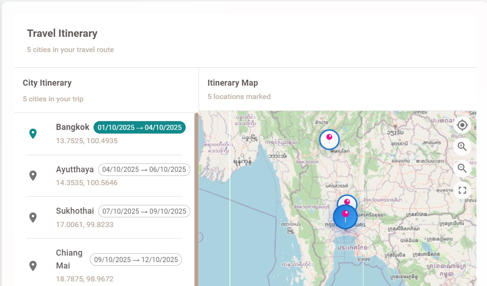

<h1 align="center">Travel Assistant (FastAPI + React)</h1>

  

<i>interactive AI travel planner</i>

  

  
  
  

  <a href="https://github.com/amarkosmarkos/TravelApp">🐱 Repository</a>
  ·
  <a href="https://amarkosmarkos.github.io/TravelApp/">📍 Live Demo</a>

An AI‑powered travel planning app. Users chat with an assistant to design multi‑city trips, receive a day‑by‑day itinerary, hotel suggestions, and an inter‑city transport plan. Backend: FastAPI + MongoDB. Frontend: React + Material UI.

### Highlights
- **Multi‑agent itinerary generation** (destination selection, routing, detection/modification, itinerary writer)
- **Transport plan** with realistic durations and heuristic costs between cities
- **Hotel suggestions** generated in background after itinerary changes
- **Real‑time chat** over **WebSocket** with streaming assistant messages
- **JWT** authentication and protected routes (bypassed in demo)
- Modern **React + MUI** interface with tabs: Chat, Itinerary, Hotels, Transport

## Feature Deep‑Dive (What each tab really does)

### Walkthrough

<b>1) Login (mock bypassed in demo)</b>

<b>2) Trip configuration (hidden in demo, auto‑seeded)</b>

<b>3) Chat with the AI assistant</b>

  <i>
    Powered by a <b>GPT‑class Large Language Model (LLM)</b> that performs intent detection and conversation orchestration. 
    User requests (e.g., "cultural trip", "add beach days at the end") trigger the workflow to either create a fresh plan or <b>modify</b> the existing one. 
    The assistant streams responses through <b>WebSocket</b> and persists messages linked to the current <code>travel_id</code>.
  </i>

<b>4) Itinerary: dates and cities</b>

  <i>
    The itinerary is produced by a <b>LangGraph</b> orchestrated pipeline coordinated by <code>SmartItineraryWorkflow</code>: 
    1) A <b>Routing Agent</b> builds a graph where nodes are cities (loaded with their <b>coordinates from MongoDB</b>) and edges represent <b>geodesic distances</b>. 
    2) The agent proposes a near‑optimal visiting order (shortest‑path / TSP‑like heuristic) across all requested cities. 
    3) An <b>Itinerary Agent</b> (LLM) writes the day‑by‑day plan aligning with the route and user preferences. 
    4) A <b>Time Budget Scheduler</b> assigns hours per city and feeds downstream services (hotels and transport). 
    In the UI you see each city with explicit date ranges (arrival → departure) derived from this schedule.
  </i>

<b>5) Hotels: suggestions per city window</b>

  <i>
    A <b>Hotel Suggestions Service</b> calls an external provider API using the itinerary windows (city + check‑in/check‑out) and the user's preferences. 
    When the itinerary is changed from the chat (e.g., cities reordered or days shifted), the hotel suggestions are <b>regenerated</b> in the background and the UI reflects the new results. 
    In the demo (mock) build, these suggestions are deterministic and consistent with the displayed itinerary.
  </i>

<b>6) Transport: inter‑city plan</b>

  <i>
    The transport plan is currently <b>heuristic‑based</b> but fully respects the itinerary's city sequence and durations. 
    It selects a <b>mode per leg</b> (car/bus/train/flight/boat) using distance thresholds and adds realistic overheads for total travel time; costs are computed with simple per‑km + fixed‑fee models. 
    Future work can plug real providers without changing the frontend.
  </i>

---

## Quick Start (Mocked Demo)

The demo runs entirely on the frontend with predefined data. No backend or database required.

1) From the repo root:
   - `cd frontend`
   - `npm install`
   - `REACT_APP_MOCK=true npm start`
2) The app opens at `http://localhost:3000` and skips login, going straight to the chat.

- Frontend: set **`REACT_APP_MOCK=true`** to enable demo mocks. The app seeds `localStorage` (token/user) and bypasses login.
- Backend: set **`MOCK_MODE=true`** to return predefined responses (optional; not needed for the GitHub Pages demo).

Deployment to GitHub Pages (gh-pages workflow) is already configured in `.github/workflows/gh-pages.yml`.

---

## Architecture (One‑Page Overview)

### Backend (FastAPI + MongoDB)
- Routers under `/api`, CORS/security middlewares, async Mongo (Motor)
- Multi‑agent orchestration with **LangGraph**:
  - `SmartItineraryWorkflow`: coordinates itinerary detection/modification, DB reads, routing, itinerary creation
  - `RoutingAgent`: builds a graph and proposes the route order (distance heuristics / TSP‑like)
  - `ItineraryAgent`: generates day‑by‑day plans from the route + preferences
  - `TimeBudgetScheduler`: allocates hours per city using total days and transport matrix
  - `TransportPlanService`: creates the inter‑city plan after itinerary changes
- Background jobs: hotel suggestions + transport plan generation after itinerary updates
- WebSocket: `/api/travels/{travel_id}/ws` for live chat

### Frontend (React + MUI)
- `MainCanvas` layout with tabs: Chat, Itinerary, Hotels, Transport
- In demo mode the app intercepts `fetch` and WebSocket to serve **mock data**
- **HashRouter** + `homepage` support for GitHub Pages

---

## Local Development (Full Stack)

### Prerequisites
- Python 3.10+
- Node.js 18+
- MongoDB (local or remote)
- Azure OpenAI credentials (if not using mock)

### Backend
1) `cd backend`
2) `pip install -r requirements.txt`
3) Create `.env` with at least:
   - `HOST=0.0.0.0`, `PORT=8000`, `SECRET_KEY=change_me`
   - `MONGODB_URL=mongodb://localhost:27017`, `DATABASE_NAME=travel_app`
   - `AZURE_OPENAI_*` variables (omit if `MOCK_MODE=true`)
   - `MOCK_MODE=false` (or `true` for a backend demo)
4) Start: `uvicorn app.main:app --host 0.0.0.0 --port 8000 --reload`

### Frontend
1) `cd frontend`
2) `npm install`
3) `npm start` (or `REACT_APP_MOCK=true npm start` for demo‑only)

---

## GitHub Pages (Live Demo)

This repository uses a **gh-pages** branch deployment:
- Workflow: `.github/workflows/gh-pages.yml`
- Build command: `npm ci && REACT_APP_MOCK=true npm run build` (in `frontend/`)
- Output: `frontend/build` → published to `gh-pages`
- SPA fallback: `404.html` copies `index.html`

Your public link: [https://amarkosmarkos.github.io/TravelApp/](https://amarkosmarkos.github.io/TravelApp/)

---

## API Overview (Backend)

All endpoints are under `/api` (JWT‑based auth in `routers/auth.py`). Highlights:

- Travels: `GET/POST /api/travels`, `GET/PUT/DELETE /api/travels/{id}`
- Itinerary: `GET/POST /api/travels/{id}/itinerary`
- Hotels: `GET /api/travels/{id}/hotels/suggestions`
- Transport: `GET /api/travels/{id}/transport-plan`
- WebSocket: `GET /api/travels/{id}/ws?token=...`

> After itinerary changes, background tasks regenerate hotels and transport automatically.

---

## License

This work is licensed under the Creative Commons Attribution‑NonCommercial 4.0 International License (CC BY‑NC 4.0).

© 2024 All rights reserved.

